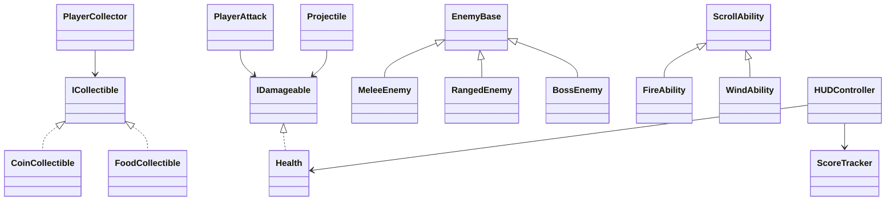

# 04 - Arquitectura propuesta

## Principios

Código en inglés, documentación en español. Sin singletons. Dependencias por Inspector. Sin `[RequireComponent]`, `Reset`, `OnValidate` ni búsquedas globales. No se implementa todavía.

## Inventario de clases

| Clase | Tipo | Responsabilidad | Datos | Métodos públicos | Parámetros/retornos | Eventos | Dependencias | Usada por | Conceptos | Wiring | Hito |
|---|---|---|---|---|---|---|---|---|---|---|---|
| IDamageable | Interfaz | Contrato para recibir daño | - | TakeDamage, IsAlive | int/bool | - | - | Ataques/proyectiles | Interface | No | 1 |
| ICollectible | Interfaz | Contrato de recolección | - | Collect | PlayerCollector param | - | - | PlayerCollector | Interface | No | 1 |
| Health | MonoBehaviour | Vida, daño, curación, muerte | max/current | TakeDamage, Heal, IsAlive | int/bool | OnHealthChanged, OnDied | - | Player/enemies | Encaps., Action | Collider según GO | 2 |
| PlayerMovement | MonoBehaviour | Movimiento top-down | speed, Rigidbody2D | Move(Vector2), GetFacingDirection | Vector2 | - | Rigidbody2D | Player | Métodos | Rigidbody2D | 3 |
| PlayerAttack | MonoBehaviour | Ataque principal | damage, range, cooldown | TryAttack, CalculateDamage | bool/int | - | Transform origin | Player | Retornos, interface | Hitbox/layer | 3 |
| EnemyBase | Clase abstracta MonoBehaviour | Lógica común enemigos | health ref, speed, target | Initialize, TickBehavior, Attack | params varios | OnEnemyDied | Health | derivados | Herencia | refs inspector | 4 |
| MeleeEnemy | MonoBehaviour derivado | Perseguir/dañar cerca | attackRange | Attack override | bool | - | EnemyBase | Nivel | Polimorfismo | Collider | 5 |
| RangedEnemy | MonoBehaviour derivado | Disparar proyectiles | projectilePrefab, cooldown | Attack override | bool | - | EnemyBase | Nivel | Polimorfismo | prefab ref | 7 |
| BossEnemy | MonoBehaviour derivado | Jefe con fases simples | phaseThreshold | Attack/Special override | bool | OnBossDefeated | EnemyBase | Objective | Herencia | refs | 11 |
| Projectile | MonoBehaviour | Mover y aplicar daño | speed, damage, direction | Launch(Vector2), SetDamage(int) | params | - | Rigidbody2D | Ranged/Boss | Métodos | Collider trigger | 7 |
| ScoreTracker | MonoBehaviour | Puntuación | score | AddScore(int), GetScore | int | OnScoreChanged | - | HUD/collectibles | Encaps., Action | UI ref externa | 8 |
| PlayerCollector | MonoBehaviour | Detectar ICollectible | - | Collect(ICollectible) | param | OnCollected | Score/PowerUp | Player | Interface/Action | trigger | 8 |
| CoinCollectible | MonoBehaviour | Sumar puntos | value | Collect(PlayerCollector) | param | - | Score via collector | Player | ICollectible | trigger | 8 |
| FoodCollectible | MonoBehaviour | Curar | healAmount | Collect(PlayerCollector) | param | - | Health | Player | ICollectible | trigger | 8 |
| TemporaryPowerUpController | MonoBehaviour | Duración buff | active, duration | Activate, Cancel, IsActive | bool | OnPowerUpStarted/Ended | Player stats/scroll | HUD | Action | inspector refs | 9 |
| ScrollLoadout | MonoBehaviour | Pergamino equipado | current/previous | EquipScroll, RestorePrevious, CanUseCurrent | bool | OnScrollChanged | abilities | Player | Abstracción | refs | 10 |
| ScrollAbility | Clase abstracta | Habilidad base | cooldown, damage | TryUse, CanUse | bool | OnAbilityUsed | - | Loadout | Herencia | No | 10 |
| FireAbility/WindAbility | Clases | Variantes habilidad | config | Execute override | bool | - | - | Loadout | Polimorfismo | No | 10 |
| DestructibleObject | MonoBehaviour | Objeto rompible | Health | - | - | - | Health | Ataque | IDamageable | Collider | Opcional |
| HUDController | MonoBehaviour | UI de salud/score/power | text refs | Update... | params | - | Health/Score/Power | UI | Action subs | inspector | 13 |
| LevelFlowController | MonoBehaviour | Transiciones | scene names | LoadMainLevel, Reload | - | OnLevelChanged | SceneManager | botones/objetivo | Action | scene names | 12 |
| ObjectiveTracker | MonoBehaviour | Victoria | boss defeated, item | CompleteObjective | bool | OnVictory | Boss/collectibles | GameResult | Action | refs | 12 |
| GameResultController | MonoBehaviour | Victoria/derrota | state | Win, Lose | - | OnVictory/OnDefeat | Health/Objective | UI | Action | refs | 13 |

## Interfaces

### IDamageable
Contrato: `TakeDamage(int amount)` e `IsAlive()`. Implementaciones previstas: `Health` en jugador/enemigos/destructibles o adaptadores directos si conviene. Permite que `PlayerAttack` y `Projectile` dañen sin conocer la clase concreta.

### ICollectible
Contrato: `Collect(PlayerCollector collector)`. Implementaciones: monedas, comida, pergaminos, power-up. Permite que el jugador recolecte objetos distintos con el mismo flujo.

## Herencia y polimorfismo

`EnemyBase` contiene target, velocidad, cooldown, referencia a Health y flujo común. `MeleeEnemy`, `RangedEnemy` y `BossEnemy` redefinen decisión de ataque. Riesgo: no agregar capas intermedias por elemento o dificultad.

## Eventos Action propuestos

- `Health.OnHealthChanged(int current, int max)`: HUD.
- `Health.OnDied()`: muerte/destrucción/derrota.
- `ScoreTracker.OnScoreChanged(int score)`: HUD.
- `PlayerCollector.OnCollected(ICollectible collectible)`: sonidos/UI si aplica.
- `TemporaryPowerUpController.OnPowerUpStarted(float duration)` y `OnPowerUpEnded()`: HUD/efecto.
- `ScrollLoadout.OnScrollChanged(ScrollAbility ability)`: HUD.
- `ObjectiveTracker.OnVictory()` y `GameResultController.OnDefeat()`: paneles/transición.

## Sistemas y flujos

- Daño: atacante obtiene `IDamageable` -> calcula daño -> `TakeDamage` -> `Health` clamp -> evento salud -> si 0 evento muerte.
- Muerte: `OnDied` -> enemigo desactiva/destruye; jugador notifica derrota; boss notifica objetivo.
- Curación: comida llama `Health.Heal` -> clamp -> `OnHealthChanged`.
- Recolección/puntuación: trigger jugador -> `ICollectible.Collect` -> Score/Health/PowerUp -> evento -> destruir objeto.
- Power-up: activar -> guardar estado si aplica -> aplicar modificador -> iniciar timer -> eventos -> restaurar/cancelar.
- Cambio de pergamino: recoger normal -> `EquipScroll` -> evento; si temporal activo, regla pendiente.
- Habilidad: input -> `CanUse` -> `TryUse(direction)` -> cooldown -> efecto/proyectil.
- Victoria: boss muere u objetivo recolectado -> `ObjectiveTracker.CompleteObjective` -> `GameResultController.Win`.
- Derrota: Player Health muere -> `GameResultController.Lose`.
- HUD: se suscribe en OnEnable y se desuscribe en OnDisable.

